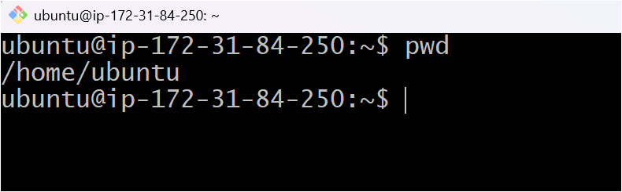
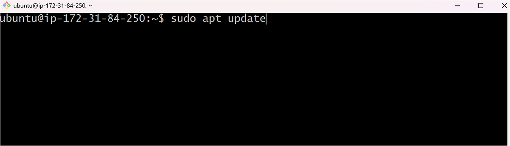
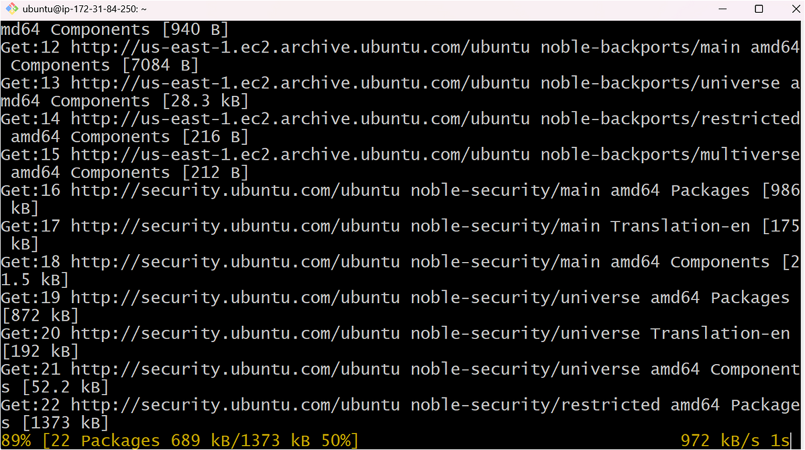
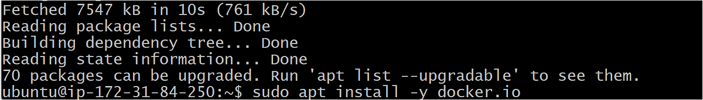
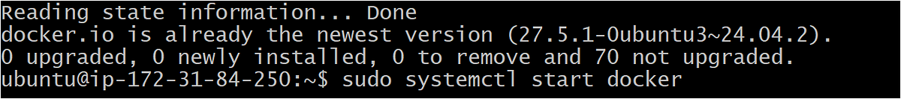
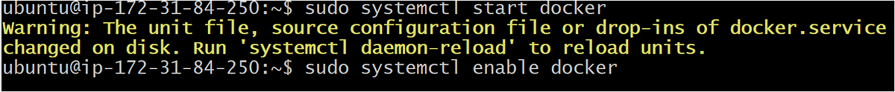
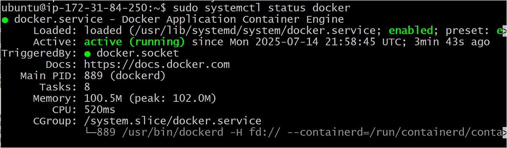
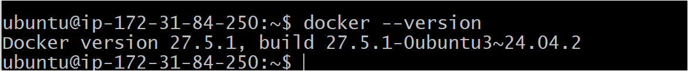

# 🐳 Lab 1: Docker Hello World on Ubuntu EC2 (All CLI — Beginner Friendly)

In this lab, you'll learn hands-on how to **install Docker** on an Ubuntu EC2 instance, verify the installation using the `hello-world` container, and understand what happens behind the scenes — all from the **command line only** (no UI, no Docker Desktop).

---

## 🔍 What you’ll learn:

- How to install Docker on Ubuntu using `apt`
- How to verify installation using the `hello-world` image
- What Docker containers and images really are
- How to list containers and images on your instance
- How to document your first Docker lab with screenshots

---

> 📁 **This folder contains step-by-step screenshots** so you can follow along visually.  
> ✍️ **For full explanations + real-world use cases, read the Medium article.**  
> 💬 “You must read the full article” — for best results.

---

## 📖 Full Guide Here:
📚 **[Docker Hello World on EC2 (Medium Article)](https://medium.com/your-article-link-here)**

---

> _This lab walks you through Docker installation and verification — a crucial first step before building real apps in containers._

**✅ Suitable for:**
- Beginners in DevOps or Cloud
- First-time Docker users
- EC2 or Linux CLI learners

---

## 🧭 Visual Walkthrough (Screenshots)

| Step | Screenshot |
|------|------------|
| 1️⃣ Step 1 |  |
| 2️⃣ Step 2 |  |
| 3️⃣ Step 3 |  |
| 4️⃣ Step 4 |  |
| 5️⃣ Step 5 |  |
| 6️⃣ Step 6 |  |
| 7️⃣ Step 7 |  |
| 8️⃣ Step 8 |  |
| 9️⃣ Step 9 |  |


---

## ⚙️ CLI Commands Used (All steps)

```bash
# Step 1: Connect to EC2
ssh -i mykey.pem ubuntu@<EC2-Public-IP>

# Step 2: Update Ubuntu Packages
sudo apt update

# Step 3: Install Docker
sudo apt install -y docker.io

# Step 4: Start Docker
sudo systemctl start docker

# Step 5: Enable Docker on boot
sudo systemctl enable docker

# Step 6: Check Docker version
docker --version

# Step 7: Run Hello World container
sudo docker run hello-world

# Step 8: List all containers
sudo docker ps -a

# Step 9: List pulled Docker images
sudo docker images
