# 🐳 Lab 2: Deploy Nginx Static Website Inside Docker on Ubuntu EC2

In this lab, you'll learn how to **serve a static HTML page** using **Nginx inside a Docker container** on an AWS EC2 instance — without using any backend frameworks or extra tools.  
We’ll go from creating a simple HTML file to making it live on the internet, all through the **command line**.

---

## 🔍 What you’ll learn:

- How to create and structure a static HTML project
- How to use the official Nginx Docker image
- How to build a custom Docker image from a `Dockerfile`
- How to run a container and map ports for external access
- How to allow inbound traffic in AWS Security Groups
- How to stop, remove, and clean up Docker containers and images

---

> 📁 **This folder contains step-by-step screenshots** so you can follow along visually.  
> ✍️ **For full explanations + real-world insights, read the Medium article.**  
> 💬 “You must read the full article” — for best results.

---

## 📖 Full Guide Here:
📚 **[Deploy Nginx Static Website Inside Docker (Medium Article)](https://medium.com/@sirohi-v/docker-project-2-devops-beginner-project-serve-static-html-with-nginx-in-docker-09bb0b28a3d7)**

---

**✅ Suitable for:**
- DevOps beginners
- Cloud learners using AWS EC2
- Anyone starting with Docker + Nginx

---

## 🧭 Visual Walkthrough (Screenshots)

| Step | Screenshot |
|------|------------|
| 1️⃣ Step | 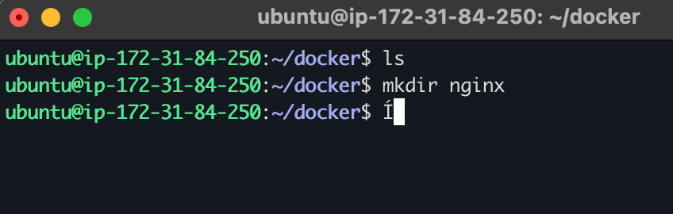 |
| 2️⃣ Step | 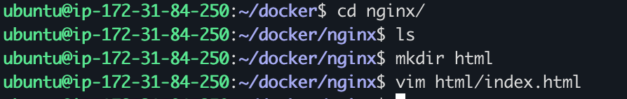 |
| 3️⃣ Step | 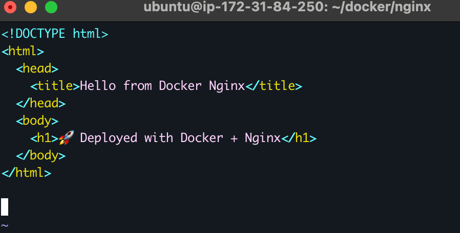 |
| 4️⃣ Step | 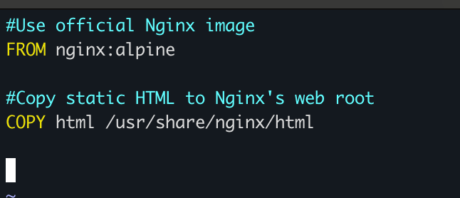 |
| 5️⃣ Step | 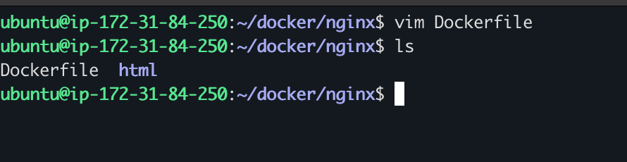 |
| 6️⃣ Step | 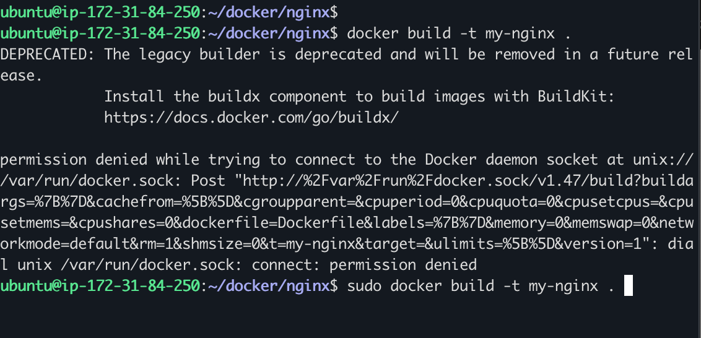 |
| 7️⃣ Step | 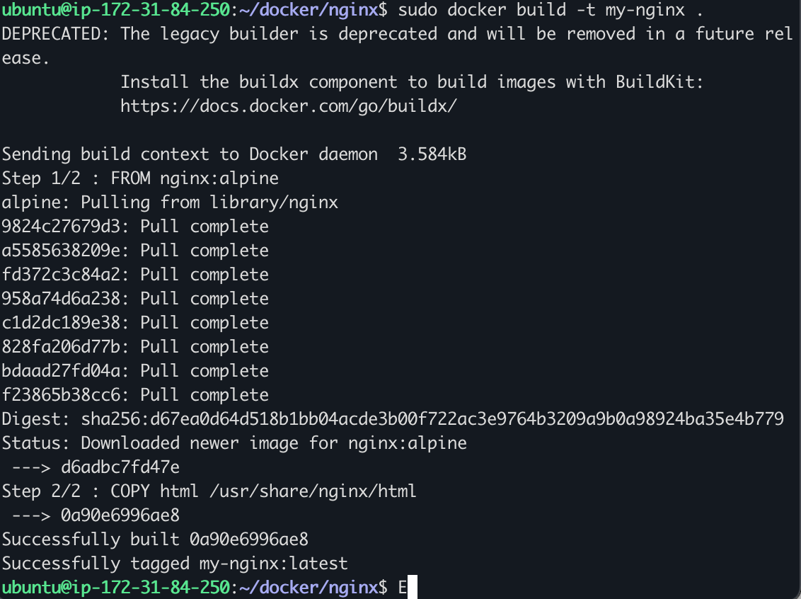 |
| 8️⃣ Step | 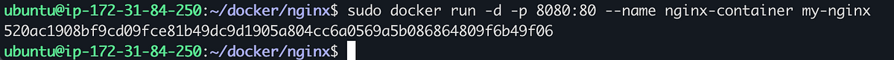 |
| 9️⃣ Step | 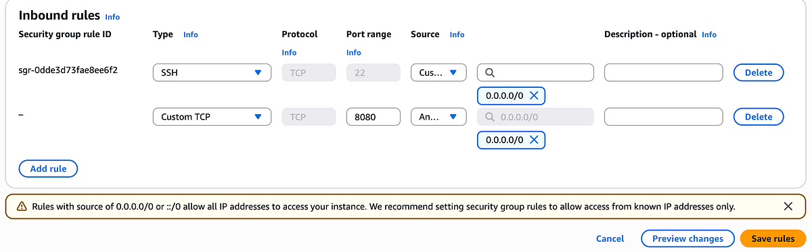 |
| 🔟 Step | 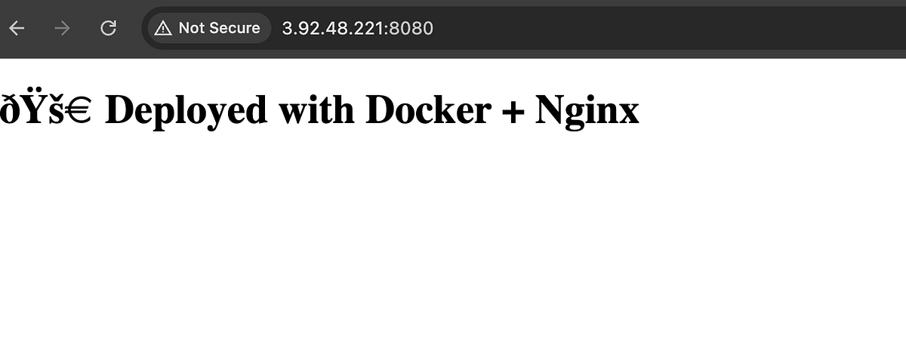 |
| 1️⃣1️⃣ Step | 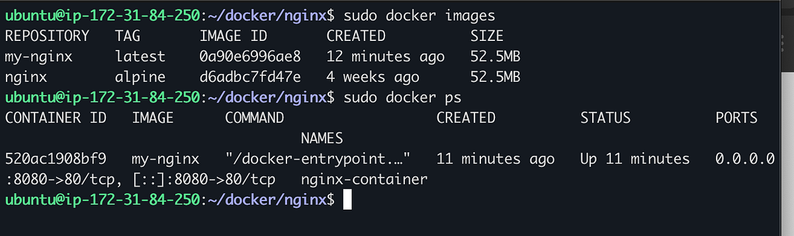 |
| 1️⃣2️⃣ Step | 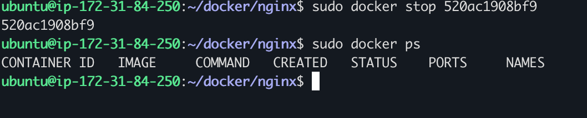 |
| 1️⃣3️⃣ Step | 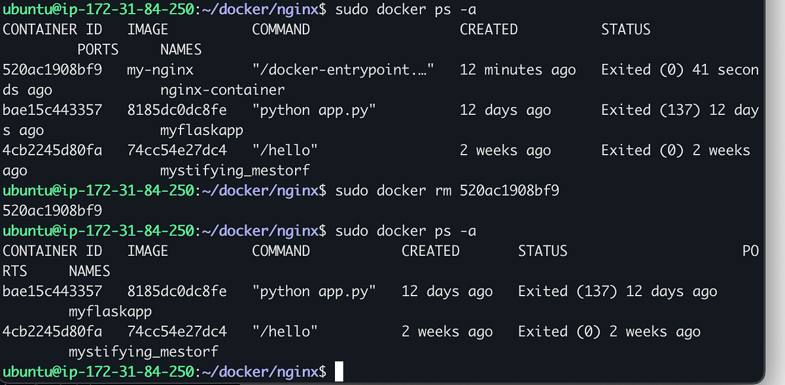 |
| 1️⃣4️⃣ Step | 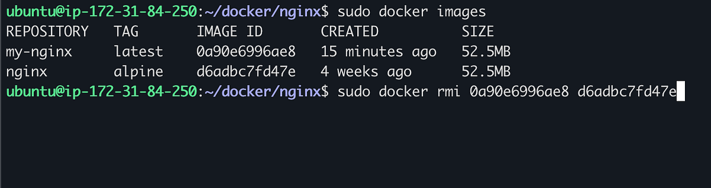 |
| 1️⃣5️⃣ Step | 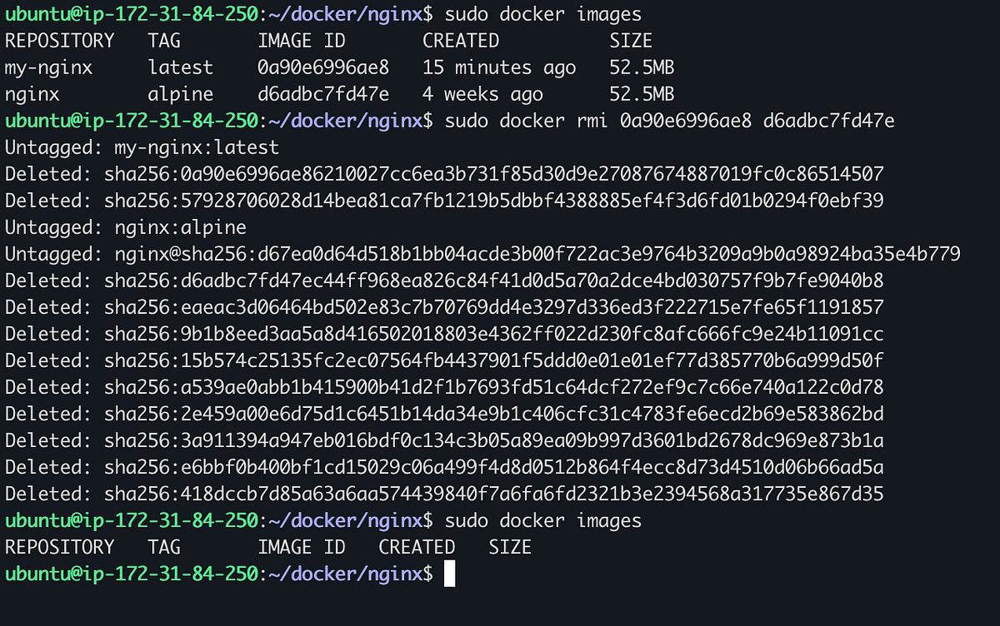 |

---

## ⚙️ CLI Commands Used (All steps)

```bash
# Step 1: Connect to EC2
ssh -i "your-key.pem" ubuntu@<EC2-Public-IP>

# Step 2: Create project folder
mkdir nginx && cd nginx

# Step 3: Create HTML folder and file
mkdir html
vim html/index.html
# Add your static HTML content and save

# Step 4: Create Dockerfile
vim Dockerfile
# Content:
# FROM nginx:alpine
# COPY html /usr/share/nginx/html

# Step 5: Build Docker image
docker build -t my-nginx .

# Step 6: Run container with port mapping
docker run -d -p 8080:80 --name nginx-container my-nginx

# Step 7: Allow inbound traffic to port 8080 in AWS Security Groups

# Step 8: View running containers
docker ps

# Step 9: View Docker images
docker images

# Step 10: Stop container
docker stop <container_id_or_name>

# Step 11: Remove container
docker rm <container_id_or_name>

# Step 12: Remove images
docker rmi my-nginx nginx

